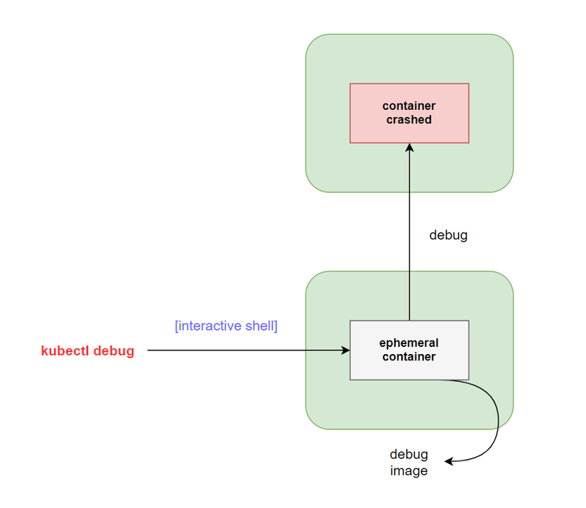

## Giới thiệu
Chào mọi người đến với series practice về kubernetes. Ở bài này chúng ta sẽ tìm hiểu về một usefull tip cho việc debug pod container ở trên kubernetes. Thông thường để debug một container ở trên k8s, ta thường sẽ dùng câu lệnh kubectl logs để xem logs lỗi hoặc dùng câu lệnh kubectl exec để ta có thể chạy câu lệnh commands ở bên trong container. Nhưng nếu ta gặp trường hợp container chạy không có hỗ trợ debugging utilities như shell, curl, bash hoặc container của ta ở trạng thái CrashLoopBackOff thì ta sẽ debug như thế nào?

Thì để giải quyết vấn đề trên thì thằng k8s có cung cấp cho ta một feature đó là ephemeral debug container.



Trước khi tìm hiểu về ephemeral container, ta sẽ xem qua các cách debug pod contaier trên k8s.

## Debug Running Pods
### Container logs
Cách đầu tiên và thông dụng nhất là ta sử dụng câu lệnh logs, như sau.

```
kubectl logs ${POD_NAME} ${CONTAINER_NAME}
```

Nó sẽ liệt kê toàn bộ logs của container đó ra, ta xem logs để debug. Nếu ta muốn xem logs của previous crashed container, ta thêm `--previous` vào nữa.

```
kubectl logs --previous ${POD_NAME} ${CONTAINER_NAME}
```

### Container exec
Cách thứ hai mà ta hay xài là dùng câu lệnh `kubectl exec`, như sau.

```
kubectl exec ${POD_NAME} -c ${CONTAINER_NAME} -- ${CMD} ${ARG1} ${ARG2} ... ${ARGN}
```

Nó sẽ cho phép ta thực thi câu lệnh command lên trên container của pod đang chạy. Ví dụ ta muốn thực thi câu lệnh vào một pod nodejs đang chạy.

```
kubectl exec -it <pod-name> -- node -v
```

Hoặc chạy câu lệnh shell ở trên container.

```
kubectl exec -it <pod-name> -- sh
```

Mọi chuyện có vẻ ok, nhưng nếu ta gặp trường hợp như ở trên ta đã nói là container chạy không có hỗ trợ debugging utilities như shell, curl, bash hoặc container của ta ở trạng thái CrashLoopBackOff thì ta không thể dùng câu lệnh `kubectl exec` được, vì nó sẽ báo lỗi như sau.

```
kubectl exec -it <pod-not-shell> -- sh
```

```
OCI runtime exec failed: exec failed: container_linux.go:346: starting container process caused "exec: \"sh\": executable file not found in $PATH": unknown
```

Còn đối với Pod mà ở trang thái CrashLoopBackOff thì ta không thể thực hiện câu lệnh exec lên nó được luôn. Do đó để giải quyết vấn đề này và để việc debug dễ dàng hơn, k8s cho ra một tính năng là *ephemeral debug container*.

## Debugging with an ephemeral debug container
> Đây là tính năng được giới thiệu ở k8s v1.16 và ở version mới nhất là 1.23 thì nó đã chuyển lên bản beta.

Ta sẽ chạy câu lệnh `kubectl debug` để tạo một ephemeral container giúp ta debug container chính. Ví dụ ta có một container sau và nó sẽ không có hỗ trợ debugging utilities như shell, bash.

```
kubectl run pod-not-debug-tool --image=k8s.gcr.io/pause:3.1 --restart=Never
```

Ta sẽ không thế chạy câu lệnh exec được.

```
$ kubectl exec -it pod-not-debug-tool -- sh

OCI runtime exec failed: exec failed: container_linux.go:346: starting container process caused "exec: \"sh\": executable file not found in $PATH": unknown
```

Ta có thể sử dụng ephemeral container để debug nó như sau.

```
kubectl debug pod-not-debug-tool --image=busybox --target=pod-not-debug-tool
```

Với giá trị sau `debug` sẽ là tên của container, và giá trị sau `--target` sẽ là tên của pod, và `--image` là tên image ta sẽ xài. Sau khi chạy câu lệnh trên thì terminal của ta sẽ hiển thị command promp của debug container, ta có thể dùng nó để debug container chính.

```
Defaulting debug container name to debugger-8xzrl.
If you don't see a command prompt, try pressing enter.
/ #
```

> Lưu ý một điểm là khi ta xài tính năng này thì khi khởi tạo cluster ta phải bật nó lên, ví dụ cluster của ta được tạo bằng kubeadm thì ta phải thêm option này vào khi khởi tạo cluster `--feature-gates=EphemeralContainers=true`.  Và option `--target` phải được support bởi Container Runtime.

Cách ở trên là ta dùng cho việc debug container pod mà không có debugging utilities, còn để debug container pod mà ở trạng CrashLoopBackOff, thì ta sẽ có một vài cách sử dụng ephemeral container như sau.

### Copying a Pod while changing its command
Trong một số trường hợp container trong pod của ta không thể chạy được, nó bị crash trước khi khởi động, thì dưới đây là cách ta sử dụng để debug các pod mà bị CrashLoopBackOff, ví dụ ta chạy pod sau mà nó sẽ bị crash.

```
kubectl run pod-crashed --image=busybox -- false
```

Kiểm tra thì ta sẽ thấy nó bị CrashLoopBackOff.

```
kubectl describe pod pod-crashed
```

```
Containers:
  myapp:
    Image:         busybox
    ...
    Args:
      false
    State:          Waiting
      Reason:       CrashLoopBackOff
    Last State:     Terminated
      Reason:       Error
      Exit Code:    1
```

Ta sẽ chạy câu lệnh sau để debug nó.

```
kubectl debug pod-crashed -it --copy-to=pod-crashed-debug --container=container-crashed-debug -- sh
```

```
If you don't see a command prompt, try pressing enter.
/ #
```

Câu lệnh trên, nó sẽ copy container pod-crashed vào trong container container-crashed-debug của pod-crashed-debug, và ta chạy câu lệnh sh ở trong container-crashed-debug để cho ta debug pod.

### Copying a Pod while changing container images
Sẽ có một vài trường hợp là container ta chạy không đủ công cụ giúp ta debug một container crashed, thì ta có thể copy container sang một image container khác mà có nhiều debug tool hơn. Ví dụ như sau:

```
kubectl run pod-crashed-two --image=busybox --restart=Never -- sleep 1d
```

Ví dụ trong busybox sẽ không có tool nslookup để ta debug dns server, ta có thể copy nó sang một image khác mà có sẵn nslookup tool, như là image ubuntu chẳng hạn.

```
kubectl debug pod-crashed-two --copy-to=pod-crashed-debug-two --set-image=*=ubuntu
```

Cú pháp `--set-image` sẽ thay đổi image của toàn bộ container trong pod đó thành ubuntu.

## Kết luận
Vậy là chúng ta đã tìm hiểu xong về cách debug pod dùng Ephemeral Container, đây là tip mà mình thấy là rất hữu ích cho việc debug trên môi trường production 😁, chỉ có cái là nó đang ở bản beta với không phải cluster nào cũng hỗ trợ sẵn 😥. Nếu có thắc mắc hoặc cần giải thích rõ thêm chỗ nào thì các bạn có thể hỏi dưới phần comment. Hẹn gặp mọi người ở bài tiếp theo.
