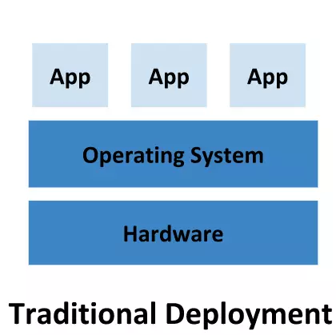
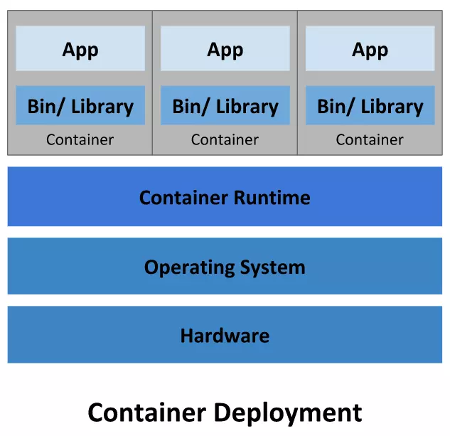
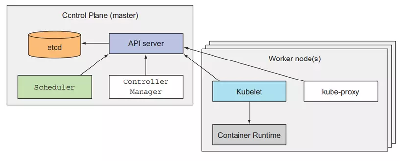

## Kubernetes là gì?
Kubernetes (hay k8s) là một nền tảng open-source được dùng để quản lý container và được phát triển bởi google. Có thể dùng kubernetes để phát triển ứng dụng trên nhiều nền tảng khác nhau như on-premise, cloud, or virtual machines. Hiện nay kubernetes được sử dụng bởi nhiều công ty lớn trong việc vận hành phần mền, phát triển ứng dụng và có cộng đồng rất lớn.

## Tại sao ta nên sử dụng kubernetes và nó giúp ta giải quyết vấn đề gì?
Để hiểu được kubernetes giúp chúng ta giải quyết những vấn đề gì, trước hết chúng ta sẽ nói qua những cách deploy ứng dụng phổ biến

### Chạy thẳng ứng dụng trên server

Ở cách này chúng ta chạy ứng dụng trên server vật lý. Điểm yếu của cách deploy này là không có cách nào định nghĩa ranh giới tài nguyên giữ các ứng dụng và nó sẽ gây ra vấn đề về phân bổ tài nguyên giữa các ứng dụng. Ví dụ khi nhiều ứng dụng chạy trên cùng server vật lý, nếu có một thằng sử dụng nhiều tài nguyên hơn và cứ tăng tài nguyên nó sử dụng (vì ta không có giới hạn) thì những thằng còn lại sẽ có ít tài nguyên để sử dụng, khiến các ứng dụng còn lại sẽ chạy chậm, để giải quyết vấn đề với cách deploy này, ta chỉ có cách là tách những thằng ứng dụng khác qua một server vật lý khác

### Chia server ra thành các máy ảo và chạy ứng dụng trên máy ảo đó

Đây là một giải pháp để giải quyết vấn đề của cách chạy thẳng ứng dụng trên server. Được gọi là virtualization, nó cho phép ta chạy nhiều máy ảo (Virtual Machines - VMs) trên cùng một server vật lý, mỗi máy ảo sẽ có file system, hệ điều hành (OS), share CPU riêng. Và những ứng dụng của ta sẽ chạy trong các VM này. VM được định nghĩa có giới hạn tài nguyên, do đó sẽ không xảy ra vấn để một ứng dụng sẽ chạy tốn tài nguyên vượt qua giới hạn VM và ảnh hưởng tới những ứng dụng nằm trong VM khác. Điểm yếu của cách deploy này là do VM được virtualize bằng cách copy cả OS và phần cứng (hardware), nên một server chỉ có thể tạo một số lượng nhỏ VM (4 hoặc 5 với các server bình thường)

### Chạy ứng dụng bằng cách sử dụng container

GIống như VM, container cũng là cách để virtualize ứng dụng, nó cũng có file system, os riêng, nhưng khác với VM, container chỉ copy OS mà không copy hardware, do đó cho phép ta có thể chạy nhiều ứng dụng trên cũng server vật lý, mỗi ứng dụng sẽ có môi trường riêng của nó. Với container việc phát triển và chạy ứng dụng của ta trên các OS khác nhau rất dễ dàng. Các bạn có thể đọc thêm về lợi ích của container [ở đây](https://medium.com/swlh/what-exactly-is-docker-1dd62e1fde38#:~:text=Docker%20is%20one%20of%20the,installed%20and%20ran%20wherever%20wanted.&text=They%20allow%20running%20multiple%20workloads,allows%20efficient%20use%20of%20resources.). Điểm yếu của container là nó chỉ có thể chạy được các ứng dụng có thể chạy trên môi trường linux. Ví dụ ứng dụng chỉ có thể chạy trên window, không thể chạy trên linux được thì container không thể chạy ứng dụng đó

### Vậy kubernetes giúp ta vấn đề gì?
Chạy ứng dụng bằng container sẽ giúp ta rất nhiều vấn đề, nhưng ta hãy thử tưởng tượng nếu số container ta lên tới hơn 1000 thì làm cách nào ta biết được một container nào đó sẽ thuộc về ứng dụng nào hoặc nó thuộc project nào? Và nếu ta muốn tăng performance của ứng dụng bằng cách cho nó chạy bằng 2 hoặc 3 container thì làm cách nào ta có thể dẫn request người dùng tới ứng dụng mà có 2 hoặc 3 container đó, ta sẽ chỉa tới container nào? Và nếu server vật lý của chúng ta bị sự cố và không thể chạy nữa thì sao? **Kubernetes sẽ giúp chúng ta giải quyết những vấn đề này nhiều nhất có thể.**

Với kubernetes chúng ta có thể group và quản lý container theo ứng dụng và project, nó cũng cung cấp tính năng Service Discovery and Load Balancing để chúng ta có thể dẫn request của ứng dụng tới đúng container, và cũng có tính năng giúp ứng dụng của chúng ta high available nhất có thể, khi một server vật lý gặp sự cố, nó có thể chuyển container của ta sang server vật lý khác. Ngoài ra kubernetes còn nhiều tính năng khác như: auto scale resource, auto restart application when failure, zero downtime deployment, automated rollouts and rollbacks application, v...v...

## Kiến trúc của Kubernetes
Kubernetes cluster (một cụm bao gồm một master và một hoặc nhiều worker) bao gồm 2 thành phần (component) chính:
+ Master nodes (control plane) 
+ Worker nodes

Master nodes bao gồm 4 thành phần chính là API server, controller manager, Scheduler, Etcd (mình sẽ giải thích rõ chức năng của từng thành phần trong bài viết khác):
* API server: thành phần chính để giao tiếp với các thành phần khác
* Controller manager: gồm nhiều controller riêng cụ thể cho từng resource và thực hiện các chứng năng cụ thể cho từng thằng resource trong kube như create pod, create deployment, v...v...
* Scheduler: schedules ứng dụng tới node nào
* Etcd: là một database để lưu giữ trạng thái và resource của cluster

Master node chỉ có nhiệm vụ control state của cluster, nó không có chạy ứng dụng trên đó, ứng dụng của chúng ta sẽ được chạy trên worker node. Worker node gồm 3 thành phần chính như:
* Container runtime (docker, rkt hoặc nền tảng khác): chạy container
* Kubelet: giao tiếp với API server và quản lý container trong một worker node
* Kubernetes Service Proxy (kube-proxy): quản lý network và traffic của các ứng dụng trong woker node

## Kết luận
Chúng ta đã nhìn qua các thành phần cơ bản của kubernetes. Đây là đường dẫn để cài một môi trường kubernetes dev: https://kubernetes.io/vi/docs/tasks/tools/install-minikube/. Sử dụng kube sẽ giúp chúng ta dễ dàng chạy và quản lý ứng dụng, các nền tảng cloud lớn cũng có cung cấp dịch vụ kubernetes rất dễ sử như AWS cung cấp EKS, Azure cung AKS, Google Cloud cung cấp GKE. Hi vọng các bạn sẽ tìm ra được lợi ích của việc chạy ứng dụng bằng kubernetes.

Đây là bài đầu tiên trong series của mình, cảm ơn các bạn đã đọc, ở bài tiếp theo chúng ta sẽ nói về thành phần cơ bản nhất để deploy một ứng dụng trên môi trường kubernetes là [Pod]. Rất mong chờ các bạn sẽ theo dõi series của mình.
