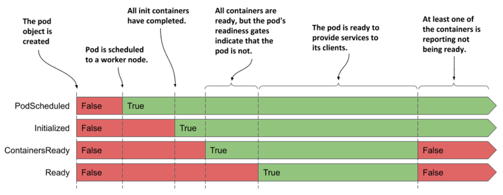
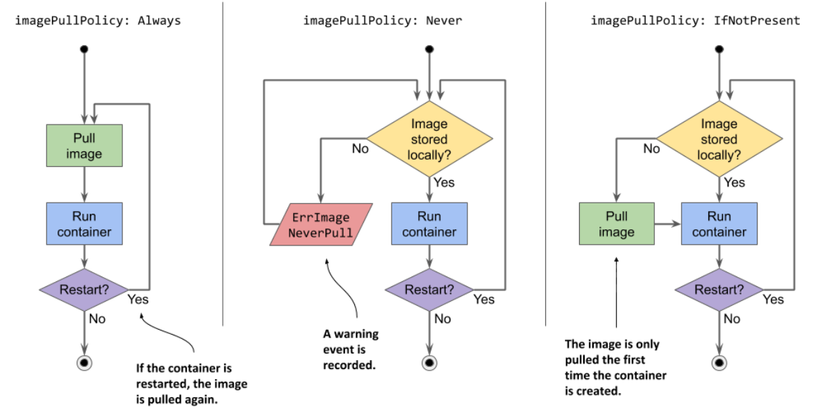
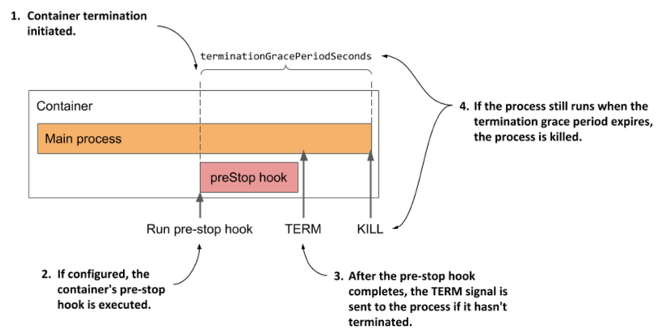
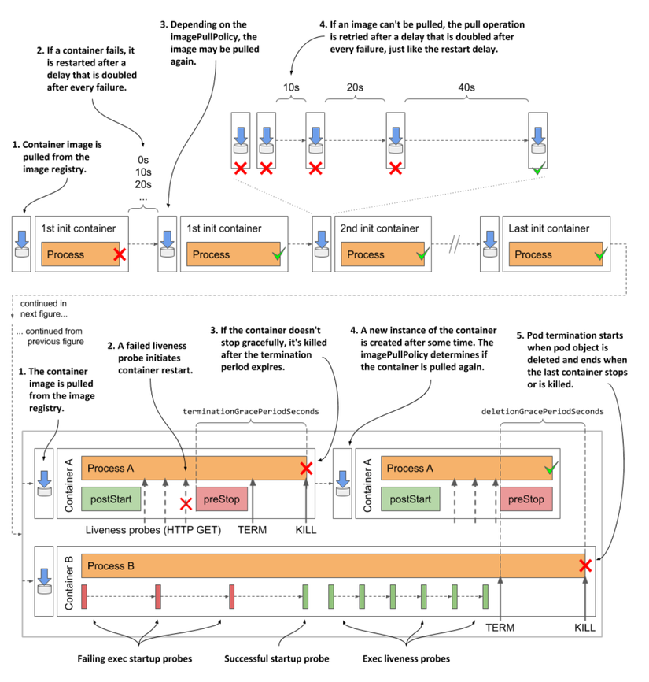
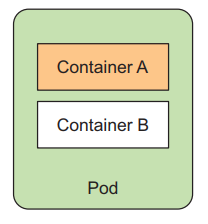
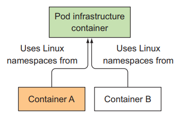

## Giới thiệu
Chào các bạn tới với series về kubernetes. Đây là bài thứ 12 trong series của mình, ở bài trước chúng ta đã nói về kiến trúc bên trong của kubernetes, từng component của nó hoạt động ra sao. Ở bài này chúng ta sẽ đi sâu hơn về Pod, xem thử một Pod sẽ cung cấp cho chúng ta những chức năng gì mà sẽ giúp ích ta nhiều hơn so với khi chạy container bình thường. Pod được thiết kế ra sao, và Pod thực chất là gì.

## Pod's status
Pod status là một trường bên trong manifest của Pod mà chứa các thông tin về Pod sau khi nó được tạo ra (đừng nhầm lẫn trường Pod status này với cột status của Pod khi ta list Pod ra bằng câu lệnh kubectl get pod), trường Pod status này là một object mà chứa các thông tin như sau:

+ Địa chỉ IP của Pod và worker node Pod deploy tới
+ Thời gian Pod đã được chạy.
+ Pod’s quality-of-service (QoS) class (sẽ nói ở bài khác)
+ Pod phase (giai đoạn của Pod)
+ Pod conditions
+ Trạng thái của từng container trong Pod

### Pod's phase
Đây là thông tin ta cần quan tâm trong trường status của Pod, trường này sẽ thể hiện cho ta biết Pod đang ở giai đoạn nào trong một lifecycle, khi một Pod được tạo ra cho tới khi nó bị xóa đi, thì trạng thái của nó sẽ nằm ở 1 trong những giai đoạn sau đây:


1. Pending phase: Pod sẽ ở trạng thái Pending cho tới khi nó được schedule tới một worker node và started.
2. Running phase: Pod sẽ ở trạng thái này khi 1 container trong Pod running thành công.
3. Succeeded phase: Pod sẽ ở trạng thái này khi tất cả các container của Pod running thành công.
4. Failed phase: chỉ cần có một contaier không chạy thành công thì Pod sẽ ở trạng thái này.
5. Unkown phase: đây là trạng thái khi mà kubelet ở một worker node không thể gửi report của Pod về cho kubernetes master.

Ta kiểm tra Pod phase bằng câu lệnh sau:

```
$ kubectl get pod <pod-name> | grep phase
phase: Running
```

### Pod's conditions
Đây là thuộc tính của Pod mà báo cho ta biết Pod đã đạt đến trạng thái mong muốn hay chưa. Thuộc tính này là một array chứa các conditions của Pod. Có 4 condition sau:

+ PodScheduled: Pod đã được scheduled tới node hay chưa.
+ Initialized: tất cả các init container đã chạy xong hết chưa.
+ ContainersReady: Tất cả các container trong Pod đã chạy được hết chưa.
+ Ready: Tất cả các container Pod đã chạy thành xong và đã có thể nhận request chưa.

> Init container là các container ta định nghĩa trong thuộc tính initContainers khi viết config Pod, những container này sẽ chạy tuần tự từng thằng một trước khi main container của ta chạy. Dùng để làm một số việc như khởi tạo resouce cho container chính.

> Vê sự khác nhau của một container đã chạy được và đã chạy được + có thể nhận request. Một container đã chạy được nghĩa là container đã running thành công, ví dụ ta chạy một ứng dụng nodejs, container running thành công khi ta chạy được câu lệnh node start index.js, mà không gặp bất kì lỗi gì. Và lưu ý khi container ta đã chạy được thì chưa chắc nó đã có thể nhận request được, ví dụ như trong ứng dụng của ta có kết nối tới DB và cache, ta cần đợi nó kết nối thành công được thì ta mới cho http.listen ở port 3000, lúc này thì ứng dụng của ta đã có thể nhận được request. Chứ trước khi http.listen được thì cho dù ứng dụng ta đã chạy, ta cũng không gửi request tới nó được.

Từng condition sẽ là một object trong mảng array Pod conditions, với các thuộc tính quan trọng sau:

+ type: tên của condition
+ status:  True, False, hoặc Unknown
+ reason: machine readable text chỉ định lý do tại sao condition này pass hoặc không pass.
+ message: human readable message chỉ định lý do chi tiết tại sao condition này pass hoặc không pass.

Từng condition này sẽ có message riêng, mà ta sẽ thường xuyên xem trường message này để biết được lý do tại sao một Pod của chúng ta không thể chạy được thành công, rất hữu ít khi ta debug.

Ta có thể list condition của Pod bằng câu lệnh sau:

```
$ kubectl describe po <pod-name> | grep Conditions: -A5
Conditions:
Type             Status
Initialized      True
Ready            True
ContainersReady  True
PodScheduled     True
```

Hiện condition chi tiết:

```
$ kubectl get po <pod-name> -o json | jq .status.conditions
[
 {
   "lastProbeTime": null,
   "lastTransitionTime": "2020-02-02T11:42:59Z",
   "status": "True",
   "type": "Initialized"
 },
...
```

Đây là hình minh họa của Pod conditions: 



### Trạng thái của từng container trong Pod
Bên cạnh Pod phase, thì kube còn track trạng thái của từng container bên trong Pod. Khi một Pod được deploy tới một node, kubelet tạo container runtime, sau đó một container sẽ có những state như sau:

+ Waiting: đây là trạng thái của container khi nó chưa được chạy.
+ Running: đây là trạng thái của container được chạy thành công và process bên trong nó chạy được mà không có vấn đề gì xảy ra.
+ Terminated: đây là trạng thái của container khi mà process đang chạy bên trong container bị terminated đi. Ví dụ process trả về exit code.
+ Unknown


Ta có thể kiểm tra state của container trong Pod bằng câu lệnh `kubectl describe pod <pod-name>`.

Ưu điểm đầu tiên khi ta dùng Pod chạy container so với chạy container bình thường là khi dùng Pod, ta có thể sử dụng init container để khởi tạo resouce cho container chính, khi init container chạy xong thì nó sẽ bị xóa đi, không chiếm resouce của chúng ta, và việc này là tự động. Ngoài ra thằng container bên trong Pod sẽ có lifecycle riêng của nó, và ta có thể config lifecycle hook để thực hiện chức năng ta muốn khi container đang khởi tạo hoặc nó bị xóa đi, trong khi ta ta chạy container bình thường thì sẽ không có được chức năng này.

Container sẽ có 2 lifecycle hook là post-start hook và pre-stop hook, post-start hook sẽ được kích hoạt khi container vừa bước trạng thái running, pre-stop hook được kích hoạt khi container vừa bước vào trạng thái Terminated.

### Sử dụng container lifecycle hook
Như đã nói ở trên thì ta xài lifecycle hook khi muốn kích hoạt một hành động khi container start-up hoặc shutdown.


Để sửa dụng lifecycle hook, ta chỉ định ở thuộc tính lifecycle khi khai báo cofig của Pod, như sau:

```yaml
  ....
  image: nginx:alpine
  lifecycle:
    postStart: # post start hook
      exec:
        command:
        - sh
        - -c
        - "apk add fortune && fortune > /usr/share/nginx/html/quote"
  ...
```

```yaml
  ...
  image: nginx:alpine
  lifecycle:
    preStop: # pre stop hook
      exec:
        command:
        - nginx
        - -s
        - quit
  ...
```

Để sử dụng post-start hook thì ta chỉ định thuộc tính postStart ở trường lifecycle khi cấu hình Pod. Tương tự khi ta muốn sử dụng pre-stop hook.

### Giữ container health sử dụng container probes
Ưu điểm thứ hai khi ta sử dụng Pod để chạy container là kube có cung cấp cho chúng ta một số phương thức để kiểm tra container của chúng ta có health hay không bằng cách sử dụng container probes.

**Cách container auto restart**

Kubernetes sẽ thường xuyên check container và mặc định restart lại nó khi nó contaier ở trạng thái failed. Cách kube restart một container phụ thuộc vào cách ta khai báo trường restartPolicy khi viết config của Pod, có 3 giá trị là:

+ Always: giá trị mặc định, sẽ restart container khi process bên trong nó trả về exit code, bất kể là giá trị nào.
+ OnFailure: chỉ restart container khi process trả về exit code khác 0.
+ Never: không bao giờ restart.


Nhưng sẽ có một vài trường hợp, process bên trong container của chúng ta có vấn đề và không thể chạy được nữa, mà nó không có trả về exit code, nên container của chúng ta sẽ không chuyển sang trạng thái failed. Nếu gặp trường hợp này thì process bên trong container của ta không chạy được nữa mà container vẫn ở trạng thái running bình thường, không có bị kube restart lại.

Ví dụ là trong ứng dụng nodejs của ta, khi ta kết nối tới DB mà lúc đó bị nghẽn mạng chẳng hạn, nếu chúng ta không try/catch thì lúc này nó sẽ văng ra lỗi và làm ứng dụng của chúng ta crash, không thể nhận request được nữa, nhưng nó không có trả về  exit code nên container của chúng ta vẫn ở trạng thái healthy trong khi process bên trong nó đã die rồi. Một ví dụ khác nữa là một ứng dụng Java sẽ văng lỗi OutOfMemoryError, nhưng JVM process nó vẫn chạy bình thường, nên container của chúng ta vẫn ở trạng thái running, trong khi ứng dụng Java đã die r.

Thì để phát hiện được những vấn để trên, kube có cung cấp cho chúng ta những container probes, mỗi thằng probe có 3 phương thức để thực hiện health checks là:

+ HTTP probe thực hiện HTTP GET request tới container và mong nhận HTTP response code ở giữ 200 và 399.
+ TCP Socket probe để check TCP connection (thường dùng cho web socket).
+ Exec probe thực hiện một command line và mong nhận về successful exit code (0).

Mỗi probe ở trên khi thực hiện health check thì sẽ trả về 1 trong 3 kết quả là: Success, Failure, Unknown.

Hai probe mà hay được sử dụng nhất là Liveness Probes và Readiness Probes.

**Liveness Probes**

Probe này kiểm tra process bên trong container có còn chạy hay không bằng cách sử dụng một trong 3 phương thức health checks trên. Nếu nó phát hiện process trong container không còn healthly nữa, nó sẽ report về kube để thực hiện restart thằng container đó lại. Ví dụ của một Pod config có sử dụng Liveness Probes:

```yaml
apiVersion: v1
kind: Pod
metadata:
  name: pod-with-liveness-check
spec:
  containers:
    - image: k8spatterns/random-generator:1.0
      name: random-generator
      env:
        - name: DELAY_STARTUP
          value: "20"
      ports:
        - containerPort: 8080
      livenessProbe: # config Liveness Probe
        httpGet: # using http method
          path: / # path to exec http check
          port: 8080 # port
        initialDelaySeconds: 30 # deplay 30s before check
```

Để sử dụng Liveness Probe thì ta dùng thuộc tính livenessProbe, ở file config trên, ta sử dụng phương thức health check là http, nó sẽ gửi GET request tới đường dẫn /, và nếu API trả về status 200 - 399 thì ứng dụng của ta vẫn healthly, thuộc initialDelaySeconds sử dụng để delay lần thực hiện health check đầu tiên, có một số ứng dụng cần thời gian khởi động lâu, nên ta cần phải delay thời gian thích hợp để chờ ứng dụng đã khởi động xong ta mới thực hiện health check, nếu không container của chúng ta sẽ cứ bị restart liên tục.


**Readiness Probes**

Liveness Probe được dùng để phát hiện process không healthly và restart nó, còn Readiness Probes thì ta sẽ sử dụng cho một mục đích khác. Nếu Readiness Probes phát hiện process bên trong container không healthly, thì nó sẽ remove container đó ra khỏi network. Ví dụ là khi ta có 3 Pod nằm phía sau một Service, khi request gửi tới Service thì nó sẽ được gửi random tới một trong những Pod phía sau, nếu ta không dùng Readiness Probes thì khi có một container không healthly thì request vẫn gửi tới đó Pod đó, còn nếu khi ta sử dụng Readiness Probes, container nào không healthly thì Pod chứa container đó sẽ bị remove ra khỏi Service. Cấu hình của Pod khi xài Readiness Probes như sau:

```yaml
apiVersion: v1
kind: Pod
metadata:
  name: pod-with-readiness-check
spec:
containers:
  - image: k8spatterns/random-generator:1.0
    name: random-generator
  readinessProbe: # config Readiness Probe
    exec: # using exec method
      command: [ "stat", "/var/run/random-generator-ready" ]
```

Để sử dụng Readiness Probe thì ta dùng thuộc tính readinessProbe, ở file config trên thì ta dùng phương thức exec để thực hiện health check.

**Ta sử dụng Liveness Probe để restart container, Readiness Probe để remove Pod ra khỏi Service nếu nó không healthly.**

### Zero downtime deploy với Readiness Probe
Ở bài [Deployment] ta có nói về vấn để zero downtime deploy. Thì kubernetes thực hiện việc đó ra sao? Thì để làm được việc đó, ta kết hợp Deployment dùng thuộc tính strategy RollingUpdate với Pod config Readiness Probe.

```yaml
apiVersion: apps/v1
kind: Deployment
metadata:
  name: socket-server
  labels:
    component: socket-server
spec:
  replicas: 3
  selector:
    matchLabels:
      component: socket-server
  template:
    metadata:
      labels:
        component: socket-server
    spec:
      containers:
        - name: socket-server
          image: registry.kala.ai/web-crm/socket-server
          ports:
            - containerPort: 3001
          envFrom:
            - configMapRef:
                name: backend
          readinessProbe:
            initialDelaySeconds: 2
            periodSeconds: 5
            tcpSocket:
              port: 3001
```

Ở file config trên, ta sử dụng Deployment với strategy deploy là RollingUpdate (mặc định khi ta không khai báo), với Readiness Probe để check web socket server có heathly để nhận request hay chưa. Khi Deployment tiến hành deploy một thằng Pod mới, lúc này ta sẽ có Readiness Probe check giùm ta Pod mới được tạo ra có thể nhận request chưa, nếu có thì Deployment mới tiến hành xóa thằng Pod cũ đi, nếu không thì nó sẽ chờ cho tới khi Pod mới nhận request được thì nó mới xóa Pod cũ. Với cách này thì ta có thể giảm tối đa thời gian downtime của server khi deploy một version mới của ứng dụng, giúp giảm ảnh hưởng tới client hơn.

## Pod's lifecycle
Ở trong phần pod status ta có nói về init container, thì init container sẽ chạy khi nào? Khi một pod được tạo ra và xóa đi, nó sẽ có 3 stages trong một lifecycle:

+ Initialization stage: ở stage này sẽ tiến hành pull image của các container xuống và các init container sẽ được chạy trong stage này.
+ Run stage: khi tất cả các init container chạy xong và main container started.
+ Termination stage: khi pod bị xóa đi thì nó sẽ ở stage này.


### Initialization stage
Ở phần initialization stage này Pod sẽ thực hiện 2 công việc là pull image và chạy hết tất cả init container theo thứ tự.

Ở phần pull image thì ta sẽ có một thuộc tính là imagePullPolicy để chỉ định hành động image sẽ được pull như thế nào, có 3 giá trị là:

+ Always: giá trị mặc định, luôn luôn kết nối tới container registry để pull image xuống khi một Pod được tạo ra.
+ Never: ở giá trị này thì Pod chúng ta sẽ không kết nối với container registry để pull image, mà cần image đã nằm sẵn ở dưới worker, có thể là lúc ta build image thì image này đã nằm trên worker rồi, này thường xảy ra khi server CI/CD với server chạy ứng dụng là một.
+ IfNotPresent: chỉ kết nối tới registry để pull image khi image không tồn tại ở worker node.



Sau khi image pull xong thì Pod sẽ thực hiện việc chạy các init container, cần tất cả các init container này chạy thành công thì Pod mới chuyển sang Run stage được.


### Run stage
Sau khi tất cả các init container chạy xong, Pod sẽ chuyển sang run stage, lúc này thì tất cả các container được định nghĩa trong Pod sẽ được tạo synchronously theo dựa vào thứ tự ta định nghĩa trong Pod (trong tương lai có thể sẽ khác, có thể tất cả các container trong Pod sẽ được tạo song song với nhau để tăng performance).

**Cẩn thận khi sử dụng post-start hook**, nếu một post-start hook block quá trình tạo ra một container, các container tiếp theo có thể sẽ không được tạo ra.

### Termination stage
Khi một Pod bị xóa thì nó sẽ bước vào stage này, ở stage này thì khi trước khi các container trong Pod bị xóa, thì sẽ có một khoảng thời gian chờ để container thực hiện pre-stop hook, và grace-full shutdown. Khoảng thời gian này ta có thể định nghĩa được ở trong trường **spec.terminationGracePeriodSeconds** khi khai báo config cho Pod. Nếu kết thúc thời gian terminationGracePeriodSeconds, thì bất kể pre-stop có chạy xong hay chưa thì container cũng sẽ bị kill đi.



Minh họa của toàn bộ Pod Lifecycle:



## Một Pod đang chạy thật ra là gì?
Chúng ta sẽ xem qua các chức năng của Pod, vậy thực ra một Pod đang chạy nó là gì? Nó sẽ bao gồm những thứ nào? Thằng nào thực hiện probe heath check cho container? Ta sẽ nói qua những vấn đề này.

Để hiểu được thì trước hết ta thử tạo một Pod:

```
$ kubectl run nginx --image=nginx
pod/nginx created
```

Bây giờ ta dùng docker ps để list các container hiện tại ra xem nó sẽ bao gồm những gì:

```
$ docker ps
CONTAINER ID  IMAGE                 COMMAND                 CREATED
c917a6f3c3f7  nginx                 "nginx -g 'daemon off"  4 seconds ago
98b8bf797174  gcr.io/.../pause:3.0  "/pause"                7 seconds ago
```

Ta sẽ thấy được container nginx được tạo ra như ta mong muốn, nhưng bên cạnh đó ta cũng sẽ thấy một container khác được tạo ra, với CMD là "/pause", và thời gian nó được tạo ra chỉ trước 1 2 giây so với lúc nginx container của chúng ta được tạo ra. Thằng container này là gì vậy, nó có tác dụng gì? Thì thằng container này sẽ được tạo song song với lúc các container trong Pod được tạo ra, nó có chức năng là sẽ chứa tất cả các thông tin về resouce mà các container cùng một Pod có thể sử dụng, như là namespace, contaier nào sẽ nằm chung Pod với các container còn lại.

Vậy từ một thằng Pod như thế này:



Sẽ được chuyển lại như sau:



Vậy còn nhiệm vụ thực hiện các probe check, thằng nào sẽ thực hiện việc đó, nếu các bạn nhớ ở bài trước khi ta nói về kiến trúc bên trong kubernetes. Thì trong worker node ta sẽ có một component là kubelet, thằng kubelet này sẽ thực hiện chức năng heath check cho container, và sẽ restart lại container khi nó failed.

**Một thằng Pod thực chất là sẽ bao gồm một pause container, và các container khác chung một nhóm. Thằng pause container sẽ chứa thông tin về infrastructure mà các container khác chung một Pod sẽ sử dụng. Và gồm kubelet để thực hiện heath check và restart.**

## Kết luận
Vậy là ta đã tìm hiểu xong về các chức nằng và kiến trúc bên trong của một thằng Pod, sử dụng healthy probe check sẽ giúp ta có thể thực hiện được việc zero downtime deploy và giữ container chủa chúng ta luôn healthy. Nếu có thắc mắc hoặc cần giải thích rõ thêm chỗ nào thì các bạn có thể hỏi dưới phần comment. Và ở bài tiếp theo chúng ta sẽ nói về cách để security một kubernetes cluster dùng **ServiceAccount** và **Role-based access control (RBAC)**.